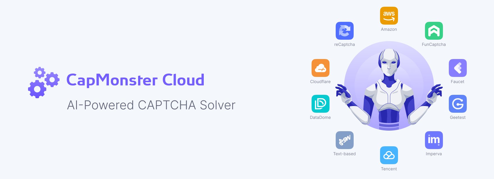

**CapMonster Cloud**

CapMonster Cloud is a cloud-based service that helps you solve CAPTCHAs
automatically. It handles common and advanced CAPTCHA types using AI, so
you don't have to. Just send a request, get a result, and keep your
automation running smoothie.

{width="6.267716535433071in"
height="2.2777777777777777in"}

# About

[[CapMonster
Cloud]{.underline}](https://capmonster.cloud/auth?utm_source=github&utm_medium=community&utm_campaign=github)
is a cloud-based CAPTCHA solver.

It uses AI to automatically solve CAPTCHAs, so you don't need manual
services or additional software.

# Key benefits:

-   No setup or installations

-   You pay only for successful results

-   Simple API and browser extensions

-   Easy integration with tool like ZennoPoster

-   Developer-friendly SDKs for fast and seamless integration

From small automation scripts to large-scale data operations, CapMonster
Cloud helps teams move faster by removing CAPTCHA-related friction.

Official website:

Documentation:

# Features

-   High Speed & Accuracy. Most CAPTCHAs are solved in 1-10 seconds with
    > up to 99% success rate.

-   AI-Powered Recognition. Advanced algorithms handle complex and
    > evolving CAPTCHA types.

-   [[Browser
    > Extensions]{.underline}](https://capmonster.cloud/extension?utm_source=github&utm_medium=community&utm_campaign=github).
    > Automatic background solving in Chrome and Firefox.

-   Easy API Integration. Ready-to-use client libraries for Python,
    > JavaScript/Node.js, C#, and more.

-   Compatibility with Other APIs

-   Scalability. Handles high loads stably, ideal for large-scale
    > projects.

-   Transparent Billing. Pay only for results; no hidden fees.

-   24/7 Support. Fast and responsive assistance for integration and
    > issues.

-   Bonus & Affiliate Programs. Earn bonuses on volume and referrals.

# Why CapMonster Cloud

-   Stability. Automatic solving under heavy loads without
    > interruptions.

-   Maximum Accuracy. Up to 99% success rate, even with complex CAPTCHA
    > types.

-   Scalability. Easily handles increasing loads while maintaining speed
    > and stability.

-   Quick Start. Ready-to-use libraries, code examples, and browser
    > extensions.

-   Affiliate Program. Earn reward from integrated users.

-   Bonus Program. Up to 15% bonus or balance based on solved volume.

-   Transparent Pricing. Pay only for successful solves.

-   Trusted by Leaders. Used by 1000+ companies worldwide.

-   Support. Fast, responsive help and setup assistance.

# Supported CAPTCHA Types

CapMonster Cloud supports a wide range of popular and complex CAPTCHA
types:

-   reCAPTCHA v2

-   reCAPTCHA v3

-   reCAPTCHA v2 Enterprise

-   reCAPTCHA v3 Enterprise

-   GeeTest V3

-   GeeTest V4

-   Cloudflare Turnstile

-   Cloudflare Challenge

-   Cloudflare Waiting Room

-   DataDome

-   Tencent CAPTCHA

-   Amazon Waf

-   Faucet Pay

-   Imperva (Incapsula)

-   Prosopo

-   Text CAPTCHA

-   Temu

-   Yidun

-   MTCaptcha

-   Altcha

-   Funcaptcha

-   Binance CAPTCHA

-   ComplexImage

For the full up-to-date list and detailed integration guides, visit the
documentation.

# Pricing

Pay-as-you-go model charges per 1,0000 successful solves (prices
approximate as of 2025; check official site for latest):

  -----------------------------------------------------------------------
  reCAPTCHA v2                        \$0.04-\$0.60
  ----------------------------------- -----------------------------------
  reCAPTCHA v3                        \$0.90

  reCAPTCHA v2 Enterprise             \$0.04-\$1.00

  reCAPTCHA v3 Enterprise             \$1.50

  GeeTest                             \$1.20

  Cloudflare Turnstile                \$1.30

  Cloudflare Bot Challenge            \$1.30

  DataDome                            \$2.20

  Tencent CAPTCHA                     \$1.60

  Amazon Waf                          \$1.40

  Faucet Pay                          \$1.00

  Imperva (Incapsula)                 \$2.00

  Prosopo                             \$1.30

  Text CAPTCHA                        \$0.30

  Temu                                \$2.00

  MTCaptcha                           \$1.50

  Altcha                              \$0.80

  Funcaptcha                          \$2.00

  Yidun                               \$1.00
  -----------------------------------------------------------------------

Features:

-   Proxy included in price where needed.

-   Bonus: Up to 15% added to balance based on monthly volume.

-   Minimum deposit: Low

# FAQ

**What is CapMonster Cloud and what is it used for?**

CapMonster Cloud is a cloud service that helps automatically recognize
various captcha types: reCaptcha V2, reCaptcha V3, reCaptcha v2
Enterprise, GeeTest, Amazon (AWS WAF), Cloudflare Turnstile, Cloudflare
Challenge, and more.

**How does CapMonster Cloud differ from other captcha recognition
services?**

-   **Reliability and scalability**: the system works stably under any
    > load, handles large volumes of tasks, and scales as your project
    > grows.

-   **Built-in proxies**: in most cases, you won't need to connect your
    > own proxies.

-   **No software installation required**: all you need is an internet
    > connection and your API key.

-   **Support for all major captcha types**: from popular to rare and
    > non-standard types.

-   **Flexible and transparent pricing**: suitable for both small
    > businesses and large-scale projects.

**How do I get started with CapMonster Cloud?**

1.  Register on the
    > [[website]{.underline}](https://capmonster.cloud/auth?utm_source=github&utm_medium=community&utm_campaign=github).

2.  Top up your balance.

3.  Use your personal API key to integrate with your project.

You can also download the CapMonster Cloud browser extension.

**Is it possible to get a refund?**

Yes, a refund is possible within 3 days after purchase if the service
does not meet your needs.

**Do you offer a trial period or free plan?**

Yes, a \$0,1 test balance is provided upon request to support.
ZennoPoster users also receive a bonus of 5,000 free captchas for
testing the service.
